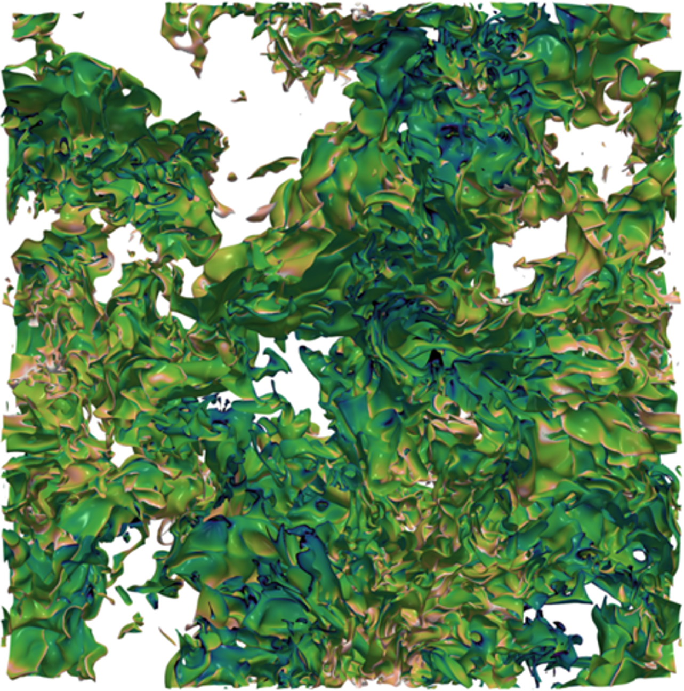

# New and Improved BLASTNet site

Built using [Minimal Mistakes](https://github.com/mmistakes/minimal-mistakes) and [Jekyll](https://jekyllrb.com). 

# Documentation for BLASTNet maintainers and contributors

This repository contains all the code for the blastnet.github.io website. Most of the Minimal Mistakes features and layouts are not used (and will likely never be used) and so they have been removed for a smoother and lighter build experience. Yet, some new features like the data counters have also been added. Therefore, please read this documentation carefully.

## Getting started

In order to build the site, a local installation of [Jekyll](https://jekyllrb.com) and [Ruby](https://www.ruby-lang.org/en/) is required.

### MacOS

MacOS comes preinstalled with Ruby, but it is generally not recommended to use the system Ruby. Therefore, first install `chruby` and `ruby-install` with [Homebrew](https://brew.sh/) (if you don't have Homebrew on your Mac, install that first!).
```bash
brew install chruby ruby-install
```

Now, install a stable version of Ruby (e.g. 3.4.1):
```bash
ruby-install ruby 3.4.1
```

Configure the shell to automatically use `chruby` so that the system Ruby will not cause issues:
```bash
echo "source $(brew --prefix)/opt/chruby/share/chruby/chruby.sh" >> ~/.zshrc
echo "source $(brew --prefix)/opt/chruby/share/chruby/auto.sh" >> ~/.zshrc
echo "chruby ruby-3.4.1" >> ~/.zshrc # run 'chruby' to see actual version
```

Finally, **quit and relaunch the terminal**, then verify Ruby is working (`ruby -v`) and install Jekyll:
```bash
gem install jekyll
```

### Linux (Debian, Ubuntu, Mint)

Linux OS generally does not come preinstalled with Ruby, so you will need to install it yourself. Personally, I recommend using a Ruby manager like `rvm`, but you can just install the Ruby library and other prerequisites like so:
```bash
sudo apt-get install ruby-full build-essential zlib1g-dev
```

It is recommended to install gems (packages) on a user basis, running these lines of code in terminal will set this up (optional):
```bash
echo 'export GEM_HOME="$HOME/gems"' >> ~/.bashrc
echo 'export PATH="$HOME/gems/bin:$PATH"' >> ~/.bashrc
source ~/.bashrc
```

Install Jekyll and Bundler:
```
gem install jekyll bundler
```

### Windows

Install RubyInstaller for Windows from https://rubyinstaller.org/downloads/ and ensure that you tick ridk install at the end to install MSYS2 and development tools. Click Enter twice. If you did not tick, then open a session in Powershell and type:
```
ridk install
```

In Powershell, verify installation with
```ruby -v
gem -v
```

Install Jekyll and the bundler with
```
gem install jekyll bundler
```

---

## Building the site

First, clone the repository:
```bash
git clone https://github.com/blastnet/blastnet.github.io
```

You can also fork the repository and clone that, if you prefer.

Then, `cd website` and install dependencies:
```bash
bundle install
```

The site is now ready to  be built using the following command:
```bash
bundle exec jekyll build
```

If you'd like to preview, you can also run
```bash
bundle exec jekyll serve
```
which will build the site and run a daemon on your local machine.

There are some options/flags that this command takes, the most pertinent of which is `--livereload` (which will cause the browser to refresh every time the site is rebuilt, i.e., every time a file is updated). If you run into an error saying the port is unavailable, chances are that you have another instance of Jekyll running already (either because you are also working on another site at the moment, or because you forgot to terminate Jekyll the last time). If you'd like to work on multiple Jekyll sites at the same time, you can specify a different port (e.g. `--port 4001`). The default port is `4000`, so to preview the site in your browser, enter the URL `localhost:4000`.

### Important

Make sure to not touch anything in the `_config.yml` file unless you know what you are doing. This file is used by Jekyll to build everything, so making a mistake here will likely break the entire website.

---

## Pushing to production

The site is built and hosted on Github pages, so it suffices to simply run `bundle exec jekyll clean` to remove the build files, then commit changes. **Please make changes on a development branch or fork, before making a pull request to the master branch. DO NOT COMMIT AND PUSH TO MASTER DIRECTLY!**

---

## Steps to add new dataset to BlastNet

1. Upload all data to Kaggle
2. Create the dataset page (see [below](#dataset-pages)) in the `_datasets` directory and upload the relevant files
    - Make sure images are uploaded correspondingly in the `assets/img` folder
    - Make sure the `.bib` file is uploaded to the assets/bib folder
    - For consistency, recommend to name the files `authorYYYY.md', `authorYYYY.bib`, `authorYYYY.png` etc.
3. Commit the changes and push to the main branch. For people without push access, create a pull request.
4. Run the `Update Firebase JSON Live` workflow to update the statistics on the backend immediately (optional, it will update the next hour).
5. The site will rebuild automatically.

If you'd like to preview, you can also clone the repository to your local machine, make the above changes, and build the website using `bundle exec jekyll serve` (assuming you have a working Jekyll installation - if not, install Jekyll, then run `bundle install` before building). If it looks good, clean up the repository by running `bundle exec jekyll clean` (so that the built files are not also uploaded). Then, you can commit the changes and open a pull request. 

## Statistics workflow

Using Github actions, we can pipe Kaggle API data to a JSON file hosted on Firebase. The JSON file is processed via Javascript Fetch API and processed client-side. This method reduces the number of Kaggle API calls and provides a backend that allows us to access the precomputed data from Kaggle. The 2024/25 version of this repository used Gist instead of Firebase and that was akin to making a fake server-side API interface, but Firebase provides a real REST API that can be used to load the JSON file, among other things. In future, the entire workflow will be moved to Firebase and Cloud Functions, but for now, please see `kaggle_json.py` for more details on how the data is ported to the JSON file. Currently, the JSON file is refreshed once every hour, and we are monitoring the number of Kaggle API calls to ensure that we are not rate-limited (because it will break the JSON file).

**IMPORTANT:** Make sure the Kaggle API key, Kaggle username, and Firebase API key (providing the "Firebase Realtime Database Admin" role) are all stored as repository secrets. To confirm, go to `Settings --> Secrets and variables --> Actions` and check that `Repository secrets` has (at least) 3 items: `FIREBASE`, `KAGGLE_APIKEY`, `KAGGLE_USERNAME`. Otherwise, the JSON update will break!

**BUG:** Sometimes the Kaggle API stops working and everything returns a zero output. This is unintended. As a fallback, old data will currently be used.

## Dataset pages

This site makes heavy use of Jekyll collections. Custom `datasets` layout is created (based on the `single` layout) and using the collections keyword, the `datasets.md` page in `_pages` collects all the dataset pages in the `_datasets` folder into the gallery, without needing to manually create a new link as was done on the previous version of the BLASTNet site. As such, the preamble of each dataset page is very important, and it's important also to have all the dataset pages in the `_datasets` folder. An example preamble is shown below:

```yaml
---
layout: datapage
excerpt: (5 cases)
title: Rayleigh-Bénard Convection
description: Rayleigh-Bénard Convection DNS
header:
  teaser: /assets/img/ico_roshan2024.png
  image: /assets/img/roshan2024.png
categories:
- nonreacting
- channel
- pipe
- turbulent
- threeD
- numerical
---
```
For each new dataset, count the number of cases and update the excerpt. Add in relevant filter categories under the `categories` keyword as shown above. Then, update the title and description as per normal. Header teaser corresponds to the icon displayed in the gallery (this keyword needs to be set or the gallery will not display correctly) and header image corresponds to the banner for the specific dataset; either set the keyword or include the banner as an image on the page using, for example, ``. Additionally, for banner images that have a square-ish or vertical aspect ratio, it is possible to put the banner image in the sidebar like:
```html
<div class="sidebar__right" style="text-align: center; top: 160px;">
    
</div>

```
Note that the `top` style property needs to be adjusted based on the table of contents height (may take trial and error; currently we are working on fixing this).

The statistics at the top of the page (views, downloads, size) should be generated automatically during the next cron scheduled update, otherwise, you can manually run the update workflow by going to `Actions --> Update Firebase JSON Live --> Run workflow`. 

Dataset description and other text can be written using Github-flavored markdown, HTML, a mixture of the two, and even LaTex (powered by MathJax). To insert equations into the page, use double `$$` like `$$y=mx+c$$` for a block equation, or single `$` like `$y=mx+c$` for an inline equation.

**IMPORTANT:** If using inline equations in a paragraph, please wrap the paragraph in `{::nomarkdown}` and `{:/}` tags.

Once the new dataset is pushed to the repository, the website should automatically rebuild and deploy. The view/download statistics may only be available after an hour or so, unless the `Update Firebase JSON Live` workflow is run manually.

## Site pages

Adding new pages (for example, maybe new FlameAI) or editing the existing ones is simple - all the pages are rendered by markdown files located in `_pages` (except for the homepage, which is in the root folder and called `index.md`). General pages use the `single` layout; the dataset page uses the `datasets` custom layout and the homepage uses the `splash` layout, which has been significantly modified from the Minimal Mistakes file. ~~Yes, I know hardcoding is bad practice; no, I don't care.~~ The layout should be specified in the preamble using the `layout:` keyword. To add a new page or external link to the navigation menu, go to `_data/navigation.yml` and add a new entry under `main`. 

## Filters

The datasets summary page contains a list of filters which are generated from the list in `_data/filters.yml`. Filter category keywords from each of the dataset pages should correspond to these. To add more filters or filter groups, modify `_data/filters.yml`.

