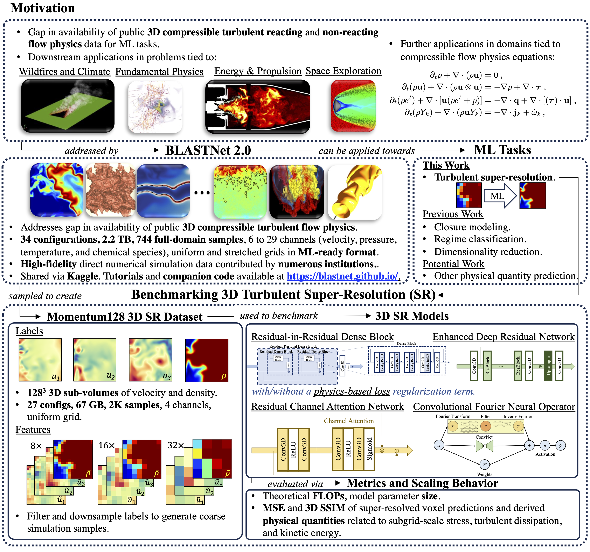
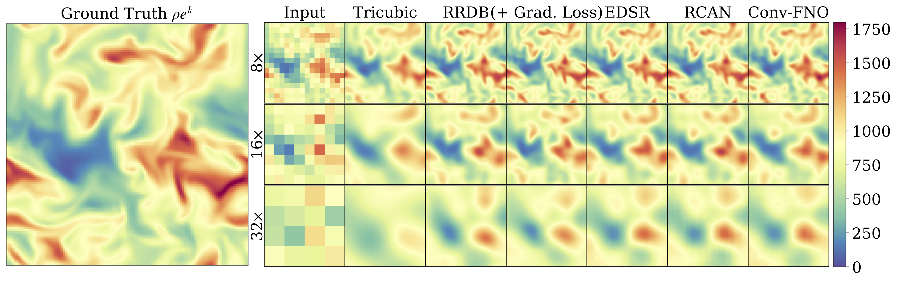
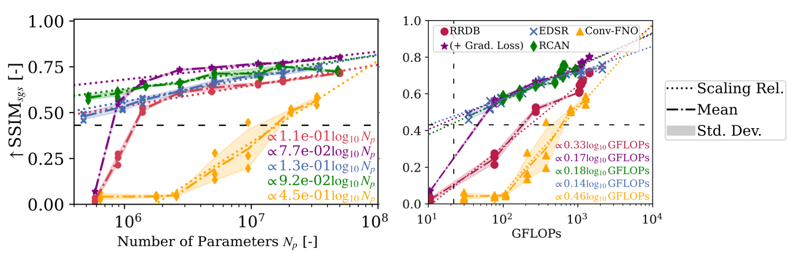

# Summary

We demonstrate the utility of BLASTNet 2.0 data for open and fair evaluation of popular ML approaches in a recent [benchmark](https://arxiv.org/pdf/2309.13457.pdf). From BLASTNet 2.0, we pre-process direct numerical simulation  data to form the Momentum128 3D SR dataset for benchmarking 3D super-resolution of turbulent flows. 
* Curate BLASTNet 2.0, a diverse public 3D compressible turbulent flow DNS dataset.
* Benchmark performance and cost of five 3D ML approache for  SR  with this publicly accessible dataset.
* Show that SR model performance can scale with the logarithm of model size and cost.
* Demonstrate the persisting benefits of a popular physics-based  gradient loss term~\cite{yu2022gradient} with increasing model size.

This is summarized in the figure below:

# Key Results
The predictions from the five model approaches are compared with tricubic interpolation:

Here's some quantitative results in the form of [neural scaling laws](https://en.wikipedia.org/wiki/Neural_scaling_law) when measured with the [SSIM](https://en.wikipedia.org/wiki/Structural_similarity) of the [subgrid-scale stress](http://www.scholarpedia.org/article/Turbulence:_Subgrid-Scale_Modeling).

Check out our  >50 page [NeurIPS paper](https://arxiv.org/pdf/2309.13457.pdf) for more results and documentation of this benchmark.

# Related Publication

W. T. Chung, B. Akoush, P. Sharma, A. Tamkin, K. S. Jung, J. H. Chen, J. Guo, D. Brouzet, M. Talei, B. Savard, A.Y. Poludnenko & M. Ihme. Turbulence in Focus: Benchmarking Scaling Behavior of 3D Volumetric Super-Resolution with BLASTNet 2.0 Data. Advances in Neural Information Processing Systems (2023) 36. [[Paper](https://arxiv.org/pdf/2309.13457.pdf), [.bib](./assets/bib/neurips.bib)]

