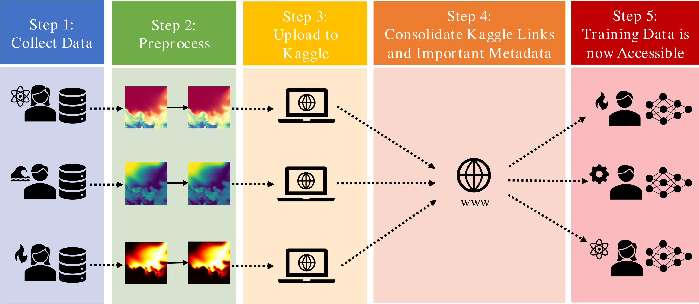

# A Network-of-Datasets for Scientific Big Data

# About
This Bearable Large Accessible Scientific Training Network-of-Datasets (BLASTNet) is composed of:
* Involvement from the scientific community.
* Public Machine Learning (ML) repositories such as Kaggle.
* Lossy compression techniques for managing >100 GB data.
* An easily-accessible webpage. (You're browsing it right now!)

Right now, our efforts are focused on community outreach for [contributions](./contribute.html) from 100 different reacting and non-reacting flow physics simulations. 

We are also interested in experimental measurements and all kinds of data from other fields so please [contact us](./contact.html) if you're interested in collaborating.

# Sharing and Compressing

Our datasets are shared via [Kaggle](https://www.kaggle.com/) since unique DOIs can be created for each dataset and a easy command line interface ([tutorial](./tutorial.html)) can be used for scientific clusters.

Many scientific data do exceed the 100 GB limit set by Kaggle. If this applies to you zip your files (.gz,.tar,.zip,_etc._) or consider error-bounded lossy compression algorithms ([tutorial](./tutorial.html)).

# Contribute
Find out how to [contribute](./contribute.html) to our project to join our growing list of authors.

# Authors and Contributors

We thank the following people for contributing and curating this network-of-datasets:

| Name      | Affilliation | Date Joined |
| ----------| -----------  | ---------- |
| Wai Tong Chung   | Stanford University   | June 6 2022 |
| Ki Sung Jung   | Sandia National Laboratory   | June 6 2022 |
| Jacqueline H. Chen | Sandia National Laboratory   | June 6 2022 |
| Matthias Ihme | Stanford University, SLAC National Laboratory  | June 6 2022 |
| Jack Guo | Stanford University   | June 6 2022 |
| Davy Brouzet | Stanford University  | June 6 2022 |
| Mohsen Talei | University of Melbourne | June 6 2022 |
| Bin Jiang | University of Melbourne | Nov 18 2022 |
| Bruno Savard | Polytechnique Montréal | Jan 26 2023 |

