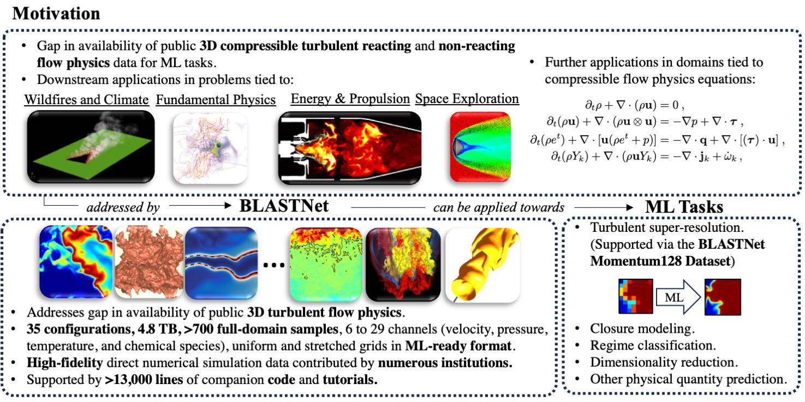

## Mission

<!-- BLASTNet 2.0 was developed to provide the researchers in  reacting and non-reacting flow physics communities with high-fidelity simulation datasets in a convenient format for ML applications. With **2.2 TB, 744 full-domain samples, and 34 configurations**, BLASTNet can effectively address these gaps and aid in fostering open/fair ML development within reacting and non-reacting flow physics communities. -->
BLASTNet aims to address gaps in open machine learning (ML) within the sciences, specifically fluid mechanics by providing researchers in reacting and non-reacting flow physics communities with (mostly) externally contributed open-source ML resources. 

This data is useful for fluid flows in a wide range of ML applications tied to automotive, propulsion, energy, and the environment. Specifically, scientific engineering tasks related to these domains may include turbulent closure modeling, spatio-temporal modeling, and inverse modeling.

These contributions now include (i) 4.8 TB of high-fidelity simulation datasets that have been processed in a convenient format for ML applications, (ii) >13,000 lines of code that aid the training and evaluating of these models, (iii) >100 pre-trained weights in flow physics problems, and (iv) regular workshop events that disseminate ML for flow physics via seminars and competitions.

## Distribution

Our ML resources are shared via GitHub and Kaggle. Specifically, code is shared via GitHub, while data and models are shared via Kaggle.

To circumvent Kaggle storage constraints, we partition our data into a network of \<100 GB subsets, with each subset containing a separate simulation configuration. This partitioned data can then be uploaded as separate datasets on Kaggle. To download all cases via [Kaggle API](./tutorial.html), download [this bash script](./assets/bash/batch_download.sh). Summaries of the data are available [here](./datasets.html)!

Our network of datasets approach:


